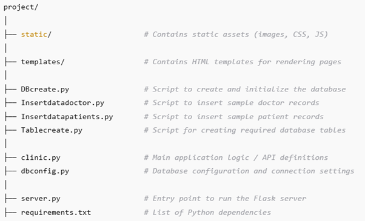

## WSAA - Web Services and Applications ##
***

This repository contains assignment, labs, my work and final project.

The purpose of this module was to introduce the different ways of obtaining data from external sources (CSO, weather servers, event information) and in what format the data can arrive (XML, JSON, CSV) and how the data can be retrieved (via API - Application Programmer's Interface) and processed using JavaScript and Python.

Learn how to create own API using the python module Flask to make data available to the outside world.

### Get Started

To get started with this project, you will need to download the necessary software/application in 
case you don't have it:

- **[Python](https://www.python.org/downloads/)** - it is a computer programming language which can be used for various of tasks, like to build website, data analysis and software testing. 

- **[Visual Studio Code](https://visualstudio.microsoft.com/downloads/)** - it is integrated 
development environment (IDE) designed by Microsoft which can be used for writing, editing, 
debugging and building the code.

- **[GitHub](https://github.com/)** - is cloud base platform which allows developers to store, 
manage and share their code. Git is open source and free to use control system which GitHub uses 
for small and large project to track any change you make in GitHub.

- **[WampServer](https://www.wampserver.com/en/)** - WampServer is a Windows web development environment, primary used for building, testing and debugging web applications. It combines Apache(web server), MySQL(database) and PHP(programming language) in a single, easily manageable package.

- **[GitHub Account](https://docs.github.com/en/get-started/start-your-journey/creating-an-account-on-github)** - to get started with GitHub, you'll need to create a free personal account and verify your email address.

If you want to explore my repositories, you can `clone` the selected repository to your device 
from my link: `git clone https://github.com/UWASIKLK/WSAA.git`. Alternatively, you can create 
`GitHub Codespases` in your existing GitHub account. Here's how: [GitHub Codespaces overview - 
GitHub Docs](https://docs.github.com/en/codespaces/overview)

### Repository

* **mywork** - this directory contains my work during the course following the lectures videos
and lab work.
* **assignments** - this directory contains the practical assignments.
* **project** - this directory contains the final project for this module.

## Assignments
***

- **Deal Cards:** Write a program that "deals" (prints) 5 cards and call it "assignment02-carddraw.py". Using the [Deck of Cards API](https://deckofcardsapi.com/) page, this is an API that simulates dealing a deck of cards.

- **CSO Data:** Write a program that retrieves the dataset for the "exchequerAccount (historical series)" from CSO and stores it into a file called "cso.json". Program name: "assignment03-cso.py".

- **Github authorisation:** Write a program in python that will read a file from a repository. The program should then replace all the instances of the text "Andrew" with your name. The program should then commit those changes and push the file back to the repository. Program name: "assignment04-github.py".

## Project
***

Create a Web application in Flask that has a RESTful API, the application should link to one or more database tables. You should also create the web pages that can consume the API. I.e. performs CRUD operations on the data. The full project description is **[here](https://github.com/andrewbeattycourseware/WSAA-Courseware/blob/main/labs/WSAA%20Project%20Description.pdf)**.

I created a "clinic" database with two tables, "doctor" and "patients", inspired by my work in the health insurance industry. The goal of this project was to design a MySQL database capable of storing and managing information about doctors and patients. The backend is developed using Python Flask, which exposes a RESTful API for database interactions. Additionally, a web interface enables users to search, add, and delete records in both the doctors and patients tables.

### Project Structure ###

- **DBcreate.py, Tablecreate.py, Insertdatadoctor.py, Insertdatapatient.py** - these Python scripts are used to set up the database for the application. The process includes creating the database, defining the “doctors” and “patients” tables, and inserting sample records into each table for testing or demonstration purposes.

- **clinic.py** - this is a basic backend logic module that processes patient and doctor data. It defines the `"Clinic"` class, which serves as an interface between the Flask application and the MySQL database. Connection to the database is done through the settings from the `"dbconfig.py"`. The module is imported and used in the `"sever.py"`, where the Flask routes call the methods defined in the `"Clinic"` class.

- **dbconfig.py** - this file is used to store the configuration settings needed to connect the python application to the MySQL database.

- **server.py** - this python script enables communication between the frontend interface (HTML pages) and the database via RESTful API, allows users to interact with doctor and patient records. It is the main entry point for running the backend, which initializes the web server, defines routes (endpoints) for handling HTTP requests, and performs operations such as retrieving or modifying data in the database.

### Route Overview - `server.py` ###

**General:**

 - `/` -  loads the home page `(index.html)`

 **Patient** Routes:

- `/patientsview` -  this will display the patients HTML page`(patientsview.html)`
- `GET/api/patients` -  this will return a list of all patients
- `GET/api/patients/<patientID>` -  this will retrieve details of a specific patient based on the patient ID input by the user
- `POST/api/patients` -  this will create a new patient based on the JSON data provided by the user
- `POST/api/patients/<patientID>` -  this will update the patient's data based on the patient ID
- `DELETE/api/patients/<patientID>` -  this deletes the patient by ID

 **Doctor** Routes:

- `/doctorview` -  this will display the patients HTML page`(doctorview.html)`
`
- `GET/api/doctor` -  this will return a list of all doctors
- `GET/api/doctor/<doctorID>` -  this will retrieve details of a specific 
doctor based on the doctor ID input by the user
- `POST/api/doctor` -  this will create a new doctor based on the JSON data 
provided by the user
- `POST/api/doctor/<doctorID>` -  this will update the doctor's data based 
on the doctor ID
- `DELETE/api/doctor/<doctorID>` -  this deletes the doctor by ID

### Installation ###

- Clone the repository:

`git clone https://github.com/UWASIKLK/WSAA.git
 cd project`

- Create virtual environment:

`python -m venv .venv` and activate it `.venv\Scripts\activate`

- Install requirements.txt:

`pip install -r requirements.txt`

- Run the necessary database setup scripts:

`python DBcreate.py`

`python Tablecreate.py`

`python Insertdatapatients.py`   (optional, if you want intitial data for patient table)

`python Insertdatadoctor.py`     (optional, if you want intitial data for doctor table)

- Run the python script:

`python server.py`

- Opent in your browser:

`http://127.0.0.1:5000`

### References ###

[Andrew Beatty Courseware](https://github.com/andrewbeattycourseware/WSAA-Courseware.git) - the lecturer’s github repository, which I mainly used.

[Deploy to Pythonanywhere](https://github.com/andrewbeattycourseware/deploytopythonanywhere.git) - the lecturer’s github repository that I used as a skeleton for my project.

[MySQL connector](https://stackoverflow.com/questions/79507899/why-mysql-connector-is-not-working-although-pymysql-is-working-to-connect-datab) - I had to use PyMySQL insetead of Python MySQL Connector.

[Using PyMySQL to connect to MySQL](https://www.geeksforgeeks.org/connect-to-mysql-using-pymysql-in-python/)

[Flask quickstart](https://flask.palletsprojects.com/en/stable/quickstart/)

[Flask App Routing](https://www.geeksforgeeks.org/flask-app-routing/)

ChatGPT - recommended to use [Flatprickr](https://flatpickr.js.org/getting-started/) to handle issues related to inscosistent full date string. Flatpickr provides a popup calendar in the web interface, which simplifies date input and ensures that all date values are formatted consistently before being processed by `server.py`.

[Rendering templates](https://www.geeksforgeeks.org/flask-rendering-templates/)

[Flask templates](https://www.geeksforgeeks.org/flask-templates/)

[CRUD in python using MySQL](https://www.geeksforgeeks.org/crud-operation-in-python-using-mysql/)

ChatGPT - I asked for the HTML viewer template for each table in database using Flask and Ajax.

[jQuery-Ajax Introduction](https://www.w3schools.com/jquery/jquery_ajax_intro.asp)

[jQuery Examples](https://www.w3schools.com/jquery/jquery_examples.asp)

[jQuery Selectors](https://www.w3schools.com/JQuery/jquery_ref_selectors.asp)

[Bootstrap](https://getbootstrap.com/docs/5.3/components/buttons/) - used for HTML viewers.

[CSS Tutorial](https://www.w3schools.com/css) - used for HTML viewers.

[Background picture](https://www.vecteezy.com/free-vector/healthcare-background) - free background pictures.